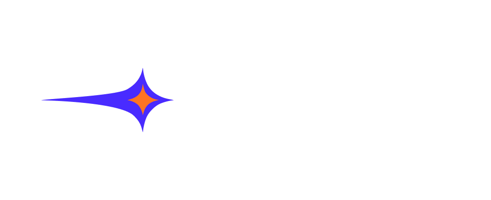

<!-- PROJECT LOGO -->  

  <h3 align="center">EXPboost</h3>

  

    A peer-funded platform that rewards for learning with transparent, milestone-based payouts.  

<!-- TABLE OF CONTENTS -->

  
Table of Contents

  <ol>
    <li><a href="#about-the-project">About The Project</a></li>
    <li><a href="#how-it-works">How It Works</a></li>
    <li><a href="#usage">Usage</a></li>
    <li><a href="#roadmap">Roadmap</a></li>
    <li><a href="#contact">Contact</a></li>
  </ol>

---

## 📚 About The Project

**EXPboost** is a gamified learning platform that tracks progress across different courses and provides tangible rewards.

Our solution is a system of daily tasks and rewards, that engages users to execute simple actions and get for that reward, boosting motivation. Learners join by purchasing a Season pass - a pass to a learning cohort, which funds a common rewards pool. As they complete tasks, they unlock real money rewards, distributed based on their progress. The more you learn, the more you earn. Our platform helps programs like School 42 track progress and reward top learners fairly. As a public good, it supports vulnerable groups of the population offering both motivation and financial rewards to make education more accessible for all.

---

## ⚙️ How It Works

- **🎟 Join a Season**  
  Buy a Season pass to contribute to the shared reward pool.

- **🔗 Connect Your Learning Profile**  
  Link your learning platform (like LearnWeb3) so we can track your tasks.

- **✅ Complete Challenges**  
  Daily, weekly, and milestone-based tasks keep you engaged and progressing.

- **🔒 Verified via Qubic Smart Contracts**  
  Qubic automates milestone validation and reward distribution.

- **🏆 Get Rewarded Fairly**  
  Earn a proportional share of the pool based on your verified learning progress.

---

## 🚀 Usage

1. **Connect wallet or**  
   To make it easier to test our project, we've added the ability to sign in as a guest to avoid any initial setup. Please, use this option if you want to test the application as fast as possible. If you have chosen this option, you can go straight to 4th step.

   If you did not choose sign in as a guest, before testing need to create account on [LearnWeb3](https://learnweb3.io/). It's the only platform we support for demo. Copy the link of your profile (it should look like `https://learnweb3.io/u/<UserNickname>/`). In the Wallet Address type your wallet from **Devnet**.

2. **Complete Learning Tasks**  
   After being redirected to the dashboard, you will see 2 active daily tasks. **Earn 1 more budge!** is already available to be checked, as you got this budge when registered on LearnWeb3. To complete the second task, you should first get experience on LearnWeb3.

3. **Track + Earn**  
   Click "Check" to verify your progress. If valid, you'll receive token reward.

---

## 📈 Roadmap

1. **Core Launch**  
   - Integrate wallet connect  
   - Write smart contract to distribute funds  
   - Create funding pool via Qubic  
   - Connect learning platforms

2. **Gamified Progress**  
   - Add XP, streaks, and seasonal challenges  
   - Add AI to personalize tasks

3. **Expanded Support**  
   - Establish partnerships with major learning platforms for course integration

4. **Token Integration**  
   - Launch EXP token for rewards

5. **Community Features**  
   - Leaderboards, grant voting, and cohort collaboration

---

## 👥 Contact

- **Jay** -- Backend Developer: [@JayKitchan](https://x.com/JayKitchan)  
- **Rinat** -- Frontend Developer: [@RinatMiniY](https://x.com/RinatMiniY)  
- **Kristina** -- UX/UI Designer: [@Kristina_Visual](https://x.com/Kristina_Visual)

<a href="#readme-top">back to top</a>

<!-- MARKDOWN LINKS & IMAGES -->
[product-screenshot]: backend/static/readmeFiles/preview.png
